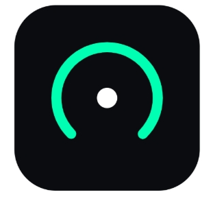

# RendiM 🚀

 <!-- Asegúrate de tener el logo en esta ruta o cambiala -->

**RendiM** es una sofisticada herramienta de *benchmarking* e investigación de rendimiento diseñada nativamente para dispositivos **iOS**. Su objetivo principal es explorar y demostrar de manera empírica los límites del hardware, exponiendo las diferencias abismales de rendimiento que pueden surgir de la arquitectura de la memoria caché y las optimizaciones de bajo nivel del compilador.

---

## 🎯 Propósito del Proyecto

En el desarrollo moderno, muchas veces se obvia lo que ocurre "bajo el capó". RendiM nace como un puente entre el desarrollo de alto nivel (aplicaciones móviles fluidas) y la ingeniería de bajo nivel (lenguaje C, manejo de punteros, y arquitectura del procesador). 

Esta herramienta es ideal para fines educativos, académicos y pruebas de concepto en entornos corporativos, demostrando conocimientos avanzados en:
- Arquitectura de Computadores.
- Foreign Function Interface (FFI).
- Comportamiento de la jerarquía de memoria (Caché L1/L2/L3).
- Optimizaciones de compiladores LLVM/Clang.

---

## ⚙️ Características Técnicas Principales

### 1. Motor Nativo en C y Dart FFI
A diferencia de las pruebas de rendimiento tradicionales hechas en lenguajes de alto nivel, el núcleo de cálculo de RendiM está escrito en **C puro**. La aplicación se comunica directamente con la memoria y el procesador de iOS utilizando `dart:ffi`, logrando una precisión cronométrica y un control absoluto sobre el hardware sin la sobrecarga de máquinas virtuales.

### 2. Análisis de la Localidad Espacial (Caché)
RendiM implementa la multiplicación de matrices en **6 variantes algorítmicas diferentes** (permutaciones de bucles `IJK`, `IKJ`, `JIK`, `JKI`, `KIJ`, `KJI`). 
Esto permite medir empíricamente cómo el acceso a memoria contigua frente a los saltos de memoria provoca "Cache Misses" masivos. Una simple permutación de bucles (de IJK a IKJ) puede llegar a multiplicar la velocidad de procesamiento por 10, demostrando el impacto crítico del diseño del software orientado a la caché.

### 3. Niveles de Optimización Dinámicos (O0 - O3)
Una característica pionera de RendiM es la posibilidad de alternar entre diferentes optimizaciones del compilador matemático en **tiempo de ejecución**. 
Mediante una inyección a nivel de proyecto en Xcode (`project.pbxproj`), RendiM aloja múltiples binarios de la misma función compilados con:
- `-O0` (Sin optimizar, ejecución bruta).
- `-O1` y `-O2` (Optimizaciones medias).
- `-O3` (Vectorización extrema, desenrollado de bucles).

### 4. Precisión Estadística
La herramienta realiza cálculos rigurosos basándose en $N$ repeticiones elegidas por el usuario, devolviendo un informe profesional con la **Media**, **Mediana** y **Desviación Típica**, garantizando que los picos de rendimiento del sistema operativo no adulteren la muestra matemática.

---

## 🛠 Arquitectura y Tecnologías

* **Frontend:** Flutter (Dart). Interfaz elegante, reactiva y fluida (soporte para Modo Oscuro/Claro).
* **Core Nativo:** C.
* **Integración OS:** iOS Native (Xcode / LLVM).
* **Interoperabilidad:** `dart:ffi` y manejo de memoria manual (`malloc` / `calloc`).

---

## 🚀 Cómo ejecutarlo

1. Clona el repositorio:
   ```bash
   git clone https://github.com/tu-usuario/rendim.git
   ```
2. Instala las dependencias:
   ```bash
   flutter pub get
   ```
3. Ejecuta la aplicación en un dispositivo iOS físico (los emuladores no reflejan el comportamiento real de la caché del hardware de Apple):
   ```bash
   flutter run -d <tu_iphone> --release
   ```
   *(Nota: Es imprescindible ejecutarlo en modo `--release` para no alterar los cronómetros con las herramientas de debug).*

---

## 💼 Valor Profesional

El desarrollo de RendiM refleja una comprensión profunda no solo del desarrollo de aplicaciones móviles modernas y su ciclo de vida, sino también de las capas más profundas de la informática. Es un claro indicador de la capacidad para identificar cuellos de botella en el rendimiento, optimizar código de misión crítica y diseñar software de alto rendimiento.

*“El software moderno es rápido, pero entender por qué es rápido es lo que diferencia a un programador de un ingeniero.”*